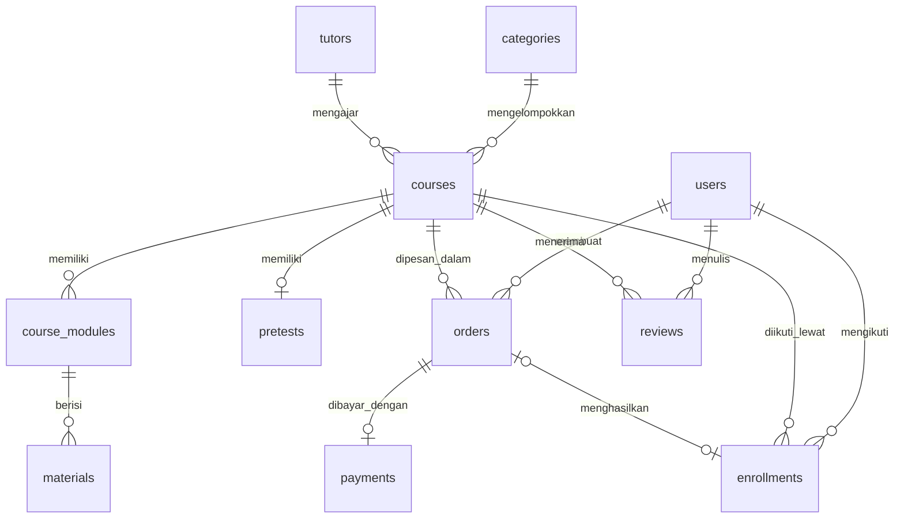

# Desain Database VideoBelajar

Dokumen ini adalah hasil **Langkah 1 (ERD)** dan **Langkah 2 (Preparation Database)**:
identifikasi entitas dari desain Figma, penentuan atribut & tipe data, relasi antar
entitas, indexing, serta DDL siap pakai.

- Diagram ERD (draw.io): [`erd.drawio`](./erd.drawio)
- DDL lengkap: [`schema.sql`](./schema.sql)
- Target DBMS: **PostgreSQL** (dipakai Supabase, rencana backend mission berikutnya).

---

## 1. Identifikasi Entitas

Sebelas entitas dari desain Figma dipetakan ke tabel berikut:

| Entitas (Figma) | Tabel | Keterangan |
|---|---|---|
| User | `users` | Akun pengguna (student & admin) |
| Produk/Kelas | `courses` | Katalog kelas yang dijual |
| Kategori Kelas | `categories` | Pemasaran, Desain, Pengembangan Diri, Bisnis |
| Tutor | `tutors` | Pengajar kelas (nama, jabatan, perusahaan) |
| Modul Kelas | `course_modules` | Bab/chapter di dalam satu kelas |
| Material (Rangkuman, Video, Quiz) | `materials` | Isi tiap modul, dibedakan lewat `material_type` |
| Pretest | `pretests` | Tes awal sebelum mulai kelas |
| Order | `orders` | Pesanan pembelian kelas (tab: Semua/Menunggu/Berhasil/Gagal) |
| Pembayaran | `payments` | Transaksi pembayaran satu order |
| Kelas Saya | `enrollments` | Keikutsertaan user pada kelas + progres belajar |
| Review | `reviews` | Rating & ulasan user terhadap kelas |

---

## 2. ERD (Entity Relationship Diagram)

File draw.io yang bisa diedit ada di [`erd.drawio`](./erd.drawio). Pratinjau relasi
(notasi crow's foot):

### Daftar Relasi

| # | Relasi | Kardinalitas | Penjelasan |
|---|---|---|---|
| 1 | `categories` — `courses` | 1 : N | Satu kategori memayungi banyak kelas; tiap kelas tepat satu kategori (`courses.category_id`). |
| 2 | `tutors` — `courses` | 1 : N | Satu tutor mengajar banyak kelas; di desain, tiap kartu kelas menampilkan satu tutor utama (`courses.tutor_id`). |
| 3 | `courses` — `course_modules` | 1 : N | Satu kelas terdiri dari banyak modul berurutan (`course_modules.course_id`). |
| 4 | `course_modules` — `materials` | 1 : N | Satu modul berisi banyak materi: rangkuman, video, atau quiz (`materials.module_id`). |
| 5 | `courses` — `pretests` | 1 : 0..1 | Satu kelas punya maksimal satu pretest; dijamin unique index pada `pretests.course_id`. |
| 6 | `users` — `orders` | 1 : N | Satu user bisa membuat banyak pesanan (`orders.user_id`). |
| 7 | `courses` — `orders` | 1 : N | Satu kelas bisa dipesan banyak kali (`orders.course_id`). |
| 8 | `orders` — `payments` | 1 : 0..1 | Satu order dibayar lewat maksimal satu pembayaran; dijamin unique index pada `payments.order_id`. |
| 9 | `users` — `enrollments` — `courses` | M : N | "Kelas Saya" adalah tabel junction: satu user ikut banyak kelas, satu kelas diikuti banyak user. Unique `(user_id, course_id)` mencegah enroll ganda. |
| 10 | `orders` — `enrollments` | 0..1 : 0..1 | Order yang berhasil menghasilkan satu enrollment; `order_id` boleh NULL untuk kelas gratis. |
| 11 | `users` — `reviews` — `courses` | M : N | Review juga junction user↔kelas; unique `(user_id, course_id)` = satu review per user per kelas. |

---

## 3. Struktur Tabel, Tipe Data, dan Indexing

Prinsip pemilihan tipe data (berlaku ke semua tabel):

- **`BIGINT` (8 byte) untuk PK/FK tabel yang tumbuh terus** (users, orders, dll.) —
  rentang ±9,2 × 10¹⁸ sehingga tidak akan overflow; `INTEGER` (4 byte, maks ±2,1 miliar)
  sebenarnya cukup lama, tetapi selisih 4 byte per baris murah dibanding biaya migrasi
  PK saat data membesar. Untuk tabel referensi yang isinya sedikit dan hampir statis
  (`categories`) dipakai `SMALLINT` (2 byte, maks 32.767) agar hemat — analog dengan
  pertimbangan `INTEGER(16)` vs `INTEGER(8)` pada soal: kapasitas disesuaikan rentang
  nilai yang realistis.
- **`VARCHAR(n)`** untuk teks pendek yang wajar dibatasi (nama, email, judul) — batas
  `n` menjadi validasi gratis di level database; **`TEXT`** untuk isi bebas yang
  panjangnya tak terprediksi (deskripsi, ulasan, URL). Di PostgreSQL keduanya sama
  efisien di penyimpanan, jadi pilihan didasarkan pada kebutuhan pembatasan, bukan performa.
- **`TIMESTAMPTZ`** untuk semua waktu — menyimpan dalam UTC + sadar zona waktu,
  aman untuk pengguna Indonesia yang punya 3 zona (WIB/WITA/WIT).
- **Harga memakai `INTEGER`**, bukan `FLOAT`/`NUMERIC` — Rupiah tidak memakai sen,
  jadi bilangan bulat sudah eksak; maksimum 2,1 miliar jauh di atas harga kelas
  (ratusan ribu). `FLOAT` dihindari karena pembulatan biner tidak eksak untuk uang.
- **`SMALLINT` untuk angka kecil ber-rentang jelas** (posisi urutan, skor 0–100,
  rating 1–5) + `CHECK` constraint sebagai pagar validitas.
- **Status memakai `VARCHAR` + `CHECK`**, bukan tipe `ENUM` — perilaku sama, tetapi
  menambah nilai status baru cukup mengubah constraint tanpa `ALTER TYPE`.

### 3.1 `users` — User

| Kolom | Tipe Data | Alasan |
|---|---|---|
| `id` | `BIGINT` identity, **PK** | Auto-increment 8 byte; aman dari overflow seiring pertumbuhan user. |
| `full_name` | `VARCHAR(100)` | Nama orang realistis < 100 karakter; batas mencegah input sampah. |
| `email` | `VARCHAR(255)` | 255 = batas praktis panjang email (RFC 5321); dipakai login. |
| `phone` | `VARCHAR(20)` | Disimpan sebagai teks, bukan angka: ada awalan `+62`/`0` yang hilang jika numerik, dan nomor telepon tidak pernah dihitung aritmetika. E.164 maks 15 digit + kode negara. |
| `password_hash` | `VARCHAR(255)` | Menyimpan hash (bcrypt ± 60 karakter), bukan password asli; 255 memberi ruang untuk algoritma hash masa depan. |
| `role` | `VARCHAR(10)` + `CHECK` | Hanya `student`/`admin` (login admin sudah ada di aplikasi); 10 karakter cukup. |
| `avatar_url` | `TEXT`, nullable | Panjang URL tak terprediksi; opsional. |
| `created_at`, `updated_at` | `TIMESTAMPTZ` | Jejak waktu berbasis UTC, sadar zona waktu. |

**Indexing `users`:**

| Index | Kolom | Jenis | Alasan |
|---|---|---|---|
| `users_pkey` | `id` | Unique single (B-Tree, otomatis dari PK) | Lookup user by id di seluruh join. |
| `uq_users_email` | `email` | **Unique single index** | Login mencari `WHERE email = ?` di tiap autentikasi — tanpa index ini jadi full table scan; unique sekaligus menegakkan aturan "email sudah terdaftar" yang kini dicek manual di form register. |

### 3.2 `categories` — Kategori Kelas

| Kolom | Tipe Data | Alasan |
|---|---|---|
| `id` | `SMALLINT` identity, **PK** | Kategori hanya segelintir (4 saat ini); 2 byte (maks 32.767) sudah berlebih — contoh nyata memilih kapasitas sesuai rentang data. |
| `name` | `VARCHAR(50)` | Label tampilan ("Pengembangan Diri"); pendek. |
| `slug` | `VARCHAR(50)` | Identifier URL (`self-development`) seperti yang dipakai filter Home saat ini. |

**Indexing `categories`:**

| Index | Kolom | Jenis | Alasan |
|---|---|---|---|
| `categories_pkey` | `id` | Unique single (PK) | Join dari `courses.category_id`. |
| `uq_categories_slug` | `slug` | **Unique single index** | Lookup kategori dari URL/query param filter; menjamin slug tidak ganda. |

### 3.3 `tutors` — Tutor

| Kolom | Tipe Data | Alasan |
|---|---|---|
| `id` | `BIGINT` identity, **PK** | Konsisten dengan PK tabel bertumbuh lain. |
| `full_name` | `VARCHAR(100)` | Nama pengajar. |
| `job_title` | `VARCHAR(100)` | Jabatan pada kartu kelas ("Senior Accountant"). |
| `company` | `VARCHAR(100)`, nullable | Perusahaan ("Gojek"); tidak semua tutor mencantumkan. |
| `avatar_url` | `TEXT`, nullable | Foto profil tutor. |
| `bio` | `TEXT`, nullable | Deskripsi bebas, panjang tak terbatas. |

**Indexing `tutors`:**

| Index | Kolom | Jenis | Alasan |
|---|---|---|---|
| `tutors_pkey` | `id` | Unique single (PK) | Join dari `courses.tutor_id`. |
| `idx_tutors_full_name` | `full_name` | **Single index** | Pencarian/pengurutan tutor by nama di halaman admin studio. |

### 3.4 `courses` — Produk/Kelas

| Kolom | Tipe Data | Alasan |
|---|---|---|
| `id` | `BIGINT` identity, **PK** | Katalog kelas terus bertambah. |
| `category_id` | `SMALLINT`, **FK → categories** | Mengikuti tipe PK induknya. |
| `tutor_id` | `BIGINT`, **FK → tutors** | Tutor utama kelas (sesuai kartu kelas di Figma). |
| `title` | `VARCHAR(150)` | Judul kelas; 150 cukup untuk judul panjang. |
| `description` | `TEXT` | Deskripsi panjang bebas. |
| `price` | `INTEGER` + `CHECK ≥ 0` | Harga Rupiah bulat (mis. 300000); eksak tanpa isu pembulatan float, 4 byte hemat vs `BIGINT`. |
| `thumbnail_url` | `TEXT`, nullable | Gambar kartu kelas. |
| `rating_avg` | `NUMERIC(2,1)` | Cache rata-rata rating (mis. 3.5) agar kartu katalog tidak menghitung `AVG(reviews)` tiap render; `NUMERIC` eksak 1 desimal, rentang 0.0–9.9 cukup untuk skala 1–5. |
| `review_count` | `INTEGER` | Cache jumlah review (mis. 86) untuk kartu katalog. |
| `created_at`, `updated_at` | `TIMESTAMPTZ` | Urut "kelas terbaru" & audit perubahan admin. |

> `rating_avg`/`review_count` adalah **denormalisasi yang disengaja**: nilainya
> diturunkan dari `reviews` dan di-update saat review masuk. Sumber kebenaran tetap
> tabel `reviews`.

**Indexing `courses`:**

| Index | Kolom | Jenis | Alasan |
|---|---|---|---|
| `courses_pkey` | `id` | Unique single (PK) | Halaman detail kelas & semua join. |
| `idx_courses_category_created` | `(category_id, created_at DESC)` | **Composite index** | Query utama katalog Home: filter tab kategori lalu urut terbaru — satu index melayani `WHERE category_id = ?` sekaligus `ORDER BY created_at DESC`; berkat leftmost prefix, filter kategori tanpa sorting pun tetap terlayani. |
| `idx_courses_tutor` | `tutor_id` | **Single index** | FK di PostgreSQL tidak otomatis ter-index; mempercepat join daftar kelas per tutor. |

### 3.5 `course_modules` — Modul Kelas

| Kolom | Tipe Data | Alasan |
|---|---|---|
| `id` | `BIGINT` identity, **PK** | Modul bertambah seiring katalog. |
| `course_id` | `BIGINT`, **FK → courses**, cascade | Modul tidak bermakna tanpa kelasnya — ikut terhapus. |
| `title` | `VARCHAR(150)` | Judul modul/bab. |
| `position` | `SMALLINT` | Urutan tampil modul; jumlah modul per kelas kecil, 2 byte cukup. |

**Indexing `course_modules`:**

| Index | Kolom | Jenis | Alasan |
|---|---|---|---|
| `course_modules_pkey` | `id` | Unique single (PK) | Join dari `materials`. |
| `uq_course_modules_course_position` | `(course_id, position)` | **Unique composite index** | Query halaman kelas "ambil semua modul kelas X terurut" terlayani penuh oleh index; unique-nya mencegah dua modul berebut posisi sama. |

### 3.6 `materials` — Material (Rangkuman, Video, Quiz)

| Kolom | Tipe Data | Alasan |
|---|---|---|
| `id` | `BIGINT` identity, **PK** | Materi adalah tabel terbanyak barisnya di konten. |
| `module_id` | `BIGINT`, **FK → course_modules**, cascade | Materi milik satu modul. |
| `material_type` | `VARCHAR(10)` + `CHECK` | Satu tabel untuk tiga jenis materi (`rangkuman`/`video`/`quiz`) sesuai entitas Figma — lebih sederhana daripada tiga tabel yang 90% kolomnya sama. |
| `title` | `VARCHAR(150)` | Judul materi. |
| `content_url` | `TEXT`, nullable | URL video/dokumen; hanya terisi untuk tipe tertentu. |
| `body` | `TEXT`, nullable | Isi rangkuman / definisi soal quiz. |
| `duration_seconds` | `INTEGER`, nullable | Durasi video dalam detik; `SMALLINT` maks ± 9 jam terlalu mepet untuk video panjang, `INTEGER` aman. |
| `position` | `SMALLINT` | Urutan materi dalam modul. |

**Indexing `materials`:**

| Index | Kolom | Jenis | Alasan |
|---|---|---|---|
| `materials_pkey` | `id` | Unique single (PK) | Penanda progres belajar per materi. |
| `uq_materials_module_position` | `(module_id, position)` | **Unique composite index** | "Ambil materi modul X terurut" — pola akses satu-satunya di halaman belajar; unique mencegah posisi ganda. |

### 3.7 `pretests` — Pretest

| Kolom | Tipe Data | Alasan |
|---|---|---|
| `id` | `BIGINT` identity, **PK** | Konsisten. |
| `course_id` | `BIGINT`, **FK → courses**, cascade | Pretest melekat pada satu kelas. |
| `title` | `VARCHAR(150)` | Judul pretest. |
| `question_count` | `SMALLINT` | Jumlah soal puluhan, 2 byte cukup. |
| `duration_minutes` | `SMALLINT` | Durasi pengerjaan dalam menit. |
| `passing_score` | `SMALLINT` + `CHECK 0–100`, nullable | Skor kelulusan skala 0–100. |

**Indexing `pretests`:**

| Index | Kolom | Jenis | Alasan |
|---|---|---|---|
| `pretests_pkey` | `id` | Unique single (PK) | Akses langsung saat mengerjakan pretest. |
| `uq_pretests_course` | `course_id` | **Unique single index** | Menegakkan kardinalitas 1:1 kelas↔pretest di level database sekaligus mempercepat join dari halaman kelas. |

### 3.8 `orders` — Order

| Kolom | Tipe Data | Alasan |
|---|---|---|
| `id` | `BIGINT` identity, **PK** | Tabel transaksi tumbuh paling cepat — 8 byte wajib. |
| `invoice_number` | `VARCHAR(30)` | Format tampilan `HEL/VI/10062023` berisi huruf & garis miring — harus teks. |
| `user_id` | `BIGINT`, **FK → users** | Pemesan. |
| `course_id` | `BIGINT`, **FK → courses** | Checkout di desain selalu satu kelas per order, jadi FK langsung tanpa tabel order-item. |
| `price` | `INTEGER` + `CHECK ≥ 0` | **Snapshot** harga saat beli — harga kelas bisa berubah, nilai historis order tidak boleh ikut berubah. |
| `admin_fee` | `INTEGER` + `CHECK ≥ 0`, default 0 | Biaya admin di halaman pembayaran. |
| `total_amount` | `INTEGER` + `CHECK ≥ 0` | `price + admin_fee`; disimpan agar nilai tagihan final eksplisit. |
| `status` | `VARCHAR(10)` + `CHECK` | `pending/paid/failed/canceled` — memetakan tab pesanan (Menunggu/Berhasil/Gagal). |
| `created_at` | `TIMESTAMPTZ` | Tanggal pesanan. |
| `expires_at` | `TIMESTAMPTZ`, nullable | Batas waktu pembayaran. |

**Indexing `orders`:**

| Index | Kolom | Jenis | Alasan |
|---|---|---|---|
| `orders_pkey` | `id` | Unique single (PK) | Detail pesanan & join payment. |
| `uq_orders_invoice` | `invoice_number` | **Unique single index** | Nomor invoice tampil ke user dan harus bisa dicari; unique menjamin tidak ada invoice kembar. |
| `idx_orders_user_status` | `(user_id, status)` | **Composite index** | Halaman "Pesanan Saya" = `WHERE user_id = ?` + filter tab `status`; leftmost prefix (`user_id`) melayani tab "Semua Pesanan" tanpa index tambahan. |
| `idx_orders_course` | `course_id` | **Single index** | Laporan penjualan per kelas & join FK yang tidak otomatis ter-index. |

### 3.9 `payments` — Pembayaran

| Kolom | Tipe Data | Alasan |
|---|---|---|
| `id` | `BIGINT` identity, **PK** | Konsisten tabel transaksi. |
| `order_id` | `BIGINT`, **FK → orders** | Pembayaran milik satu order. |
| `payment_method` | `VARCHAR(20)` | Kode metode (`bca_va`, `gopay`, `credit_card`, …) sesuai pilihan transfer bank/e-wallet/kartu di Figma; daftar metode masih bisa bertambah sehingga tidak dikunci `CHECK`. |
| `amount` | `INTEGER` + `CHECK ≥ 0` | Nominal Rupiah bulat yang benar-benar dibayar. |
| `status` | `VARCHAR(10)` + `CHECK` | `pending/success/failed` — status dari gateway. |
| `paid_at` | `TIMESTAMPTZ`, nullable | Terisi saat pembayaran sukses. |

**Indexing `payments`:**

| Index | Kolom | Jenis | Alasan |
|---|---|---|---|
| `payments_pkey` | `id` | Unique single (PK) | Referensi dari webhook gateway. |
| `uq_payments_order` | `order_id` | **Unique single index** | Menegakkan 1:1 order↔payment di level database + join dua arah yang cepat. |

### 3.10 `enrollments` — Kelas Saya

| Kolom | Tipe Data | Alasan |
|---|---|---|
| `id` | `BIGINT` identity, **PK** | Surrogate key sederhana. |
| `user_id` | `BIGINT`, **FK → users** | Peserta. |
| `course_id` | `BIGINT`, **FK → courses** | Kelas yang diikuti. |
| `order_id` | `BIGINT`, **FK → orders**, nullable | Order asal enrollment; NULL untuk kelas gratis. |
| `progress_percent` | `SMALLINT` + `CHECK 0–100` | Progres belajar (%) di kartu "Kelas Saya"; rentang pasti 0–100 → 2 byte cukup. |
| `pretest_score` | `SMALLINT` + `CHECK 0–100`, nullable | Hasil pretest user pada kelas ini; NULL = belum mengerjakan. |
| `completed_at` | `TIMESTAMPTZ`, nullable | Terisi saat kelas selesai (dasar penerbitan sertifikat). |
| `created_at` | `TIMESTAMPTZ` | Tanggal mulai ikut kelas. |

**Indexing `enrollments`:**

| Index | Kolom | Jenis | Alasan |
|---|---|---|---|
| `enrollments_pkey` | `id` | Unique single (PK) | Update progres per baris. |
| `uq_enrollments_user_course` | `(user_id, course_id)` | **Unique composite index** | Aturan bisnis "satu user sekali enroll per kelas" ditegakkan database; leftmost prefix (`user_id`) sekaligus melayani listing halaman "Kelas Saya". |
| `idx_enrollments_course` | `course_id` | **Single index** | Hitung jumlah peserta per kelas & join sisi kelas. |
| `uq_enrollments_order` | `order_id` | **Unique single index** | Satu order maksimal satu enrollment (NULL bebas berulang untuk kelas gratis). |

### 3.11 `reviews` — Review

| Kolom | Tipe Data | Alasan |
|---|---|---|
| `id` | `BIGINT` identity, **PK** | Review bertambah terus. |
| `user_id` | `BIGINT`, **FK → users** | Penulis review. |
| `course_id` | `BIGINT`, **FK → courses** | Kelas yang direview. |
| `rating` | `SMALLINT` + `CHECK 1–5` | Bintang 1–5; tipe angka terkecil yang tersedia di PostgreSQL (tidak ada `TINYINT`), rata-rata (mis. 3.5) dihitung saat agregasi. |
| `comment` | `TEXT`, nullable | Ulasan bebas, boleh kosong (rating saja). |
| `created_at` | `TIMESTAMPTZ` | Urut review terbaru. |

**Indexing `reviews`:**

| Index | Kolom | Jenis | Alasan |
|---|---|---|---|
| `reviews_pkey` | `id` | Unique single (PK) | Moderasi/penghapusan review. |
| `uq_reviews_user_course` | `(user_id, course_id)` | **Unique composite index** | Satu user satu review per kelas — dicegah di level database, bukan hanya UI. |
| `idx_reviews_course_created` | `(course_id, created_at DESC)` | **Composite index** | Halaman detail kelas menampilkan review per kelas urut terbaru; leftmost prefix (`course_id`) juga melayani agregasi `AVG(rating)` per kelas saat menyegarkan cache `courses.rating_avg`. |

> Catatan umum: semua index di atas bertipe **B-Tree** (default PostgreSQL) karena
> pola akses aplikasi adalah pencarian kesamaan (`=`), join FK, dan pengurutan
> rentang — kasus yang paling efisien dilayani B-Tree. Index lain (GIN/full-text
> untuk pencarian judul kelas) sengaja belum dibuat sampai fitur pencariannya ada;
> setiap index memperlambat INSERT/UPDATE sehingga hanya dibuat untuk query nyata.

---

## 4. Naming Convention

| Aturan | Contoh | Alasan |
|---|---|---|
| Semua identifier `snake_case`, huruf kecil | `course_modules`, `full_name` | PostgreSQL melipat identifier tanpa kutip ke huruf kecil — `snake_case` menghindari keharusan mengutip `"fullName"` selamanya. |
| Nama tabel **plural**, bahasa Inggris | `users`, `courses`, `reviews` | Tabel adalah kumpulan baris; konsisten satu bahasa agar tidak campur (`users` + `kelas_saya`). |
| PK selalu `id` | `users.id` | Seragam dan pendek; konteks tabel sudah jelas dari join. |
| FK = `<tabel_singular>_id` | `user_id`, `course_id`, `module_id` | Sekali baca langsung tahu tabel tujuannya. |
| Kolom waktu berakhiran `_at` | `created_at`, `paid_at`, `expires_at` | Membedakan timestamp dari kolom biasa secara sekilas. |
| Kolom satuan menyebut satuannya | `duration_seconds`, `duration_minutes`, `progress_percent` | Menghilangkan ambigu satuan tanpa harus membuka dokumentasi. |
| Unique index `uq_<tabel>_<kolom>` | `uq_users_email` | Prefix `uq_`/`idx_` membuat jenis index terbaca dari namanya saat muncul di error/EXPLAIN. |
| Index biasa `idx_<tabel>_<kolom>` | `idx_orders_user_status` | Idem. |
| Nilai enum/status huruf kecil | `pending`, `paid`, `rangkuman` | Konsisten dengan identifier; perbandingan string tidak tergantung kapitalisasi. |

---

## 5. Ringkasan Preparation Database

Menjalankan [`schema.sql`](./schema.sql) pada PostgreSQL/Supabase akan membuat
11 tabel + 17 index (di luar PK) dengan seluruh constraint (`FK`, `UNIQUE`,
`CHECK`) di atas, urut sesuai dependensi sehingga bisa dieksekusi sekali jalan.
Database siap dipakai untuk pengembangan website pada mission berikutnya.
